# SmartPhoto Multi-Tag Pipeline

A fully reproducible ML pipeline for **multi-label image classification** (photo tagging).

## Table of Contents

* [Quick-Start Guide](#quick-start-guide)
* [Problem & Business Context](#problem--business-context)
* [Architecture](#architecture)
* [Data Section](#data-section)
* [Model(s)](#models)
* [Training & Evaluation](#training--evaluation)
* [Experiment Tracking](#experiment-tracking)
* [FiftyOne Visualization](#fiftyone-visualization)
* [CRISP-DM Traceability Matrix](#crisp-dm-traceability-matrix)
* [Repository Tree](#repository-tree)
* [Future Work](#future-work)
* [License](#license)

## Quick-Start Guide

Clone the repo and set up the environment. Then acquire the data and run a test training:

```bash
# Clone repository
git clone https://github.com/your-org/SmartPhotoMultiTag_pipeline.git
cd SmartPhotoMultiTag_pipeline

# (Optional) Create a virtual environment
python -m venv .venv && source .venv/bin/activate

# (Optional) Or start development container which handles environment setup

# Install dependencies
pip install -r requirements.txt

# Download sample data (default MAX_SAMPLES=10)
python scripts/run_download_data.py --max-samples 100

# Run a quick train (short epochs or few samples for a smoke test)
python scripts/run_train.py --epochs 5
```

After running, you should see training logs (loss/metric values) and a checkpoint saved in the `checkpoints/` directory (e.g. `best_epoch_*.pt`).

## Problem & Business Context

This project addresses automated photo tagging. In many domains (e.g. media libraries, social platforms, retail catalogs), images must be labeled with multiple object tags (people, animals, objects, etc.). This is a **multi-label classification** task: each image can have several tags at once. Manual annotation is time-consuming, so we train a model to predict all relevant tags for a photo. In this demo we filter COCO to a few classes (10: "person",  "dog", etc.) for brevity, but the system is general to any set of labels.

## Architecture

The pipeline is structured into modular components for data ingestion, training, and evaluation. The diagram below summarizes the main components:


An end-to-end workflow (from raw data to tagged output) is illustrated below:


The following diagrams illustrate the internal and external workflows of key pipeline components:

**Component Workflow:**  
Shows the high-level flow from CLI entry point through data loading, model building, training loop, logging, and results visualization.



**CocoDataset Internal Flow:**  
Details the internal steps of the `CocoDataset` class, including initialization, image validation, annotation parsing, label creation, transforms, and data retrieval.

<p align="center">
    
</p>

**Git Workflow:** The repository uses Git with a `master` branch. Pull Requests (to `master`) trigger CI checks: code formatting (Black, isort, flake8) and unit tests. A quick training run is also executed in CI (`ci.yml`). A separate workflow (`mainSelfHosted.yml`) is configured for a self-hosted runner to run the full pipeline (data + training) as needed.

**Reproducibility:** Docker/DevContainer are used for a consistent environment (see `.devcontainer/`). Experiment parameters and results are tracked with MLflow (local `mlruns/` directory). 

**Results Viewer:** The `run_fiftyone_with_predicted.py` script launches the FiftyOne App to inspect model predictions on the test set, making it easy to visualize tags on images.

## Data Section

COCO-2017 dataset is used as the source of images and annotations. Data loading and filtering are handled via FiftyOne. By default we focus on the classes `person`, `dog`, `cat`, `car`, `bus`, `bicycle`, `pizza`, `apple`, `cell phone` and `laptop` (the `DEFAULT_CLASSES` in code), but this can be changed via arguments. A small subset of images (controlled by `--max-samples`) is used by default (e.g. 10 images total) for quick CI tests. The data preparation does the following:

* Download COCO with FiftyOne Zoo and filter to target classes.
* Split into train/validation/test (≈70/10/20% of samples).
* Save images and labels in `src/data/coco/{train,val,test}/` in COCO format (via FiftyOne exports).
* Save metadata (ids, counts, classes) in `src/data/coco/dataset_metadata.json`.
* Apply data augmentations at training time (random resized crop, flips, rotation, color jitter) and a standard resize+center-crop for validation (see `config.py`).

These steps ensure that downstream training sees a consistent prepared dataset. The `run_download_data.py` script automates this preparation.

## Model(s)

The table below summarizes the models in use, along with example best metrics and parameters from MLflow runs. All are multi-label classifiers (no softmax): they output logits per class and use **Binary Cross-Entropy with Logits**.

| Model           | Backbone                                             | Head                     | Loss          | Best Metrics (Highest mAP / Lowest val_loss) | Key Params from Best Run                                            |
| --------------- | ---------------------------------------------------- | ------------------------ | ------------- | -------------------------------------------- | ------------------------------------------------------------------- |
| **BasicMLC**    | ResNet-18 (pretrained)                               | Linear (to num\_classes) | BCEWithLogits | 1.0 / 0.3845                                 | `model_backbone=resnet18`, `batch_size=5`, `optim_lr=0.0003`        |
| **PhotoTagNet** | ResNet-18 / ResNet-50 / EfficientNet-B0 (pretrained) | Linear (to num\_classes) | BCEWithLogits | 0.8113 / 0.7131                              | `model_backbone=resnet50`, `batch_size=32`, `model_dropout_rate=0.5`, `optim_lr=0.0003` |

`BasicMLC` uses a standard ResNet18 backbone. `PhotoTagNet` supports configurable backbones (ResNet-18/50, EfficientNet) with optional freezing. The final layer is a fully-connected head mapping to the target classes. Loss is computed per-label as binary cross-entropy with sigmoid activation.

## Training & Evaluation

Training is done via the `scripts/run_train.py` script, which invokes `run_training()` in `src/train.py`. For example, to train for 5 epochs with ResNet-18:

```bash
python scripts/run_train.py --epochs 20 --backbone resnet18
```

During training, loss and multi-label metrics (macro-F1, micro-F1, precision\@K, mAP, ROC-AUC) are logged. The script prints progress per epoch and saves the best model checkpoint to `checkpoints/best_epoch_{epoch}.pt`. For instance, after a run you might see:

> `[5/5] train=0.1234  val=0.1500  macroF1=0.800`  (best on epoch 4, checkpoint saved)

Evaluation on the validation set is done each epoch inside the training loop. The `checkpoints/` directory stores model states; the script also saves example prediction plots (e.g. confusion matrix, ROC curves) in `results/` and logs them to MLflow.

## Experiment Tracking

We use **MLflow** to track experiments. By default, runs are logged locally under the `mlruns/` directory (Git-ignored). The parameters (config, hyperparameters) and metrics are automatically logged. To visualize past runs, start the MLflow UI in the project root:

```bash
mlflow ui
```

Then open [http://localhost:5000](http://localhost:5000) in a browser to inspect run metrics, parameters, and artifacts (plots, model files).

## FiftyOne Visualization

**FiftyOne** is used to visualize images, ground truth labels, and model predictions. After training, you can launch the FiftyOne App to explore results interactively. To start the viewer with predicted tags on the test set, run:

```bash
python scripts/run_fiftyone_with_predicted.py
```

This will open the FiftyOne App in your browser, allowing you to browse images, inspect predicted vs. true tags, and filter by class or prediction outcome. The viewer helps with qualitative analysis and error inspection, making it easy to understand model behavior on real data.

## CRISP-DM Traceability Matrix

This pipeline follows the **CRISP-DM** methodology for data mining. Below we map each phase to the code components:

| Phase (CRISP-DM)       | Implementation (Code)                                                       |
| ---------------------- | --------------------------------------------------------------------------- |
| Business Understanding | README (this section) – problem description                                 |
| Data Understanding     | `src/data/loader.py`, `dataset_metadata.json` (data summary)                |
| Data Preparation       | `scripts/run_download_data.py`, filtering/splitting in `src/data/loader.py`, Datasethandling in `src/data/CocoDataset` |
| Modeling               | `src/models/*` (model definitions) and `src/train.py`                       |
| Evaluation             | `src/utils/metrics.py`, `src/train.py` (validation loop)                    |
| Deployment/Review      | `scripts/run_fiftyone_with_predicted.py` (results inspection)               |

## Repository Tree

Key files and directories in the repository:

```
SmartPhotoMultiTag_pipeline/
├── .devcontainer/          (development container config)
├── .github/workflows/      (CI/CD pipeline YAMLs)
├── src/                    (source code)
│   ├── config.py           (hyperparameters, paths)
│   ├── data/               (dataset loading and preprocessing)
│   ├── models/             (model architectures)
│   ├── utils/              (training/eval helpers, metrics)
│   ├── train.py            (training loop implementation)
│   └── evaluate.py         (standalone evaluation script)
├── scripts/                (entry-point scripts)
│   ├── run_download_data.py
│   ├── run_pipeline.py
│   ├── run_train.py
│   └── run_fiftyone_with_predicted.py
├── tests/                  (unit tests)
├── .gitignore
├── pyproject.toml
├── requirements.txt
└── README.md
```

## Future Work

Potential next steps and improvements include:

* **Data versioning:** Integrate DVC or similar to track changes in datasets and models across runs.
* **Larger dataset:** Remove the synthetic subset limit and train on the full COCO classes (expand `DEFAULT_CLASSES`).
* **Model enhancements:** Implement the `PhotoTagNet` architecture (with advanced backbones) in training and compare its performance to `BasicMLC`.
* **Hyperparameter tuning:** Automate hyperparameter search (e.g. via Optuna or MLflow) for better performance.
* **Deployment:** Package the trained model as a service (e.g. REST API) or integrate with a frontend for real-time tagging.

## License

No license is included with this repository. (GitHub-Copilot was used as a support tool.)
